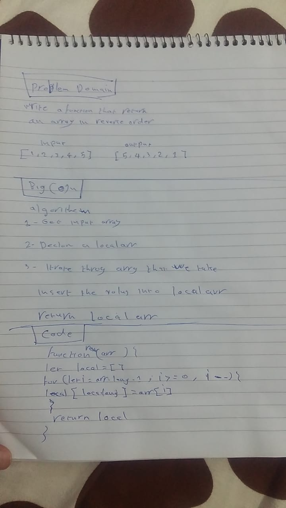

## Challenge
Write a function called reverseArray which takes an array as an argument. Without utilizing any of the built-in methods available to your language, return an array with elements in reversed order.

## Approach & Efficiency
make an local  array
iterate through the array backwards
insert element at local array
return the local array
## BigO
time:O(n)

