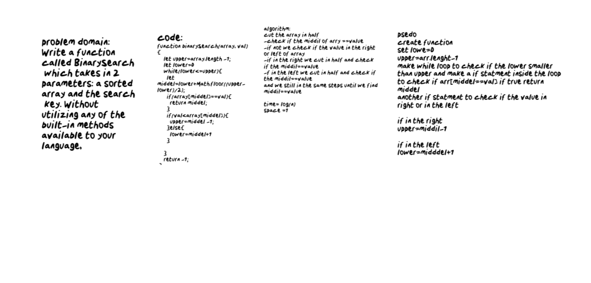

## Challenge
Write a function called BinarySearch which takes in 2 parameters: a sorted array and the search key. Without utilizing any of the built-in methods available to your language,
## Approach & Efficiency
cut the array in half
-check if the middil of arry ==value
-if not we check if the value in the right or left of array
-if in the right we cut in half and check if the middil==value
-f in the left we cut in half and check if the middil==value
and we still in the same steps until we find 
middil==value

- time= log(n)
- space =1

