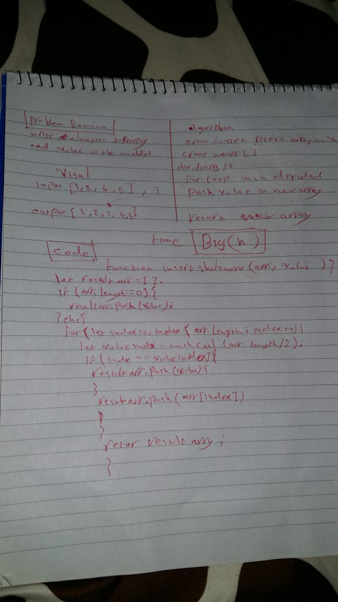
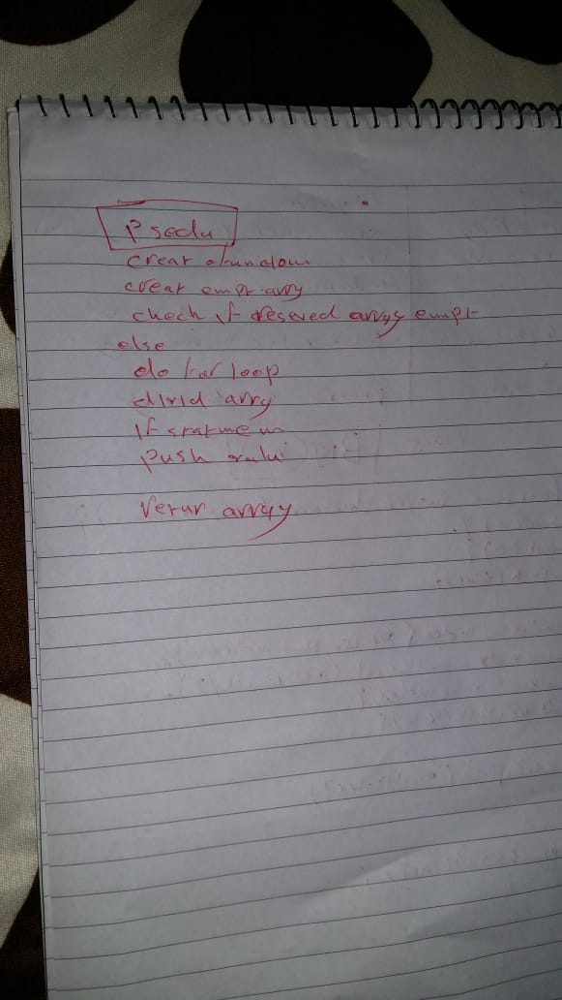

## Challenge
Write a function called insertShiftArray which takes in an array and the value to be added. Without utilizing any of the built-in methods available to your language, return an array with the new value added at the middle index.

## Approach & Efficiency
make an new  array
divide array /2
itreate in to divided array
push value at new array 

## BigO
time:O(n)

