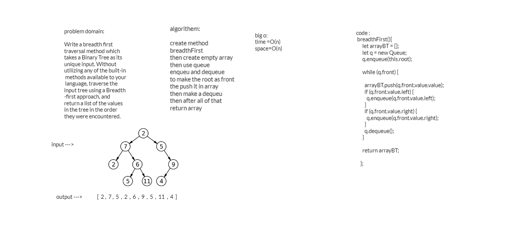

## challenge
Write a breadth first traversal method which takes a Binary Tree as its unique input. Without utilizing any of the built-in methods available to your language, traverse the input tree using a Breadth-first approach, and return a list of the values in the tree in the order they were encountered.

## Approach & Efficiency

create method breadthFirst
then create empty array
then use queue 
enqueu and dequeue 
to make the root as front the push it in array
then make a dequeu
then after all of that 
return array

## big o:

time =O(n)
space=O(n)

