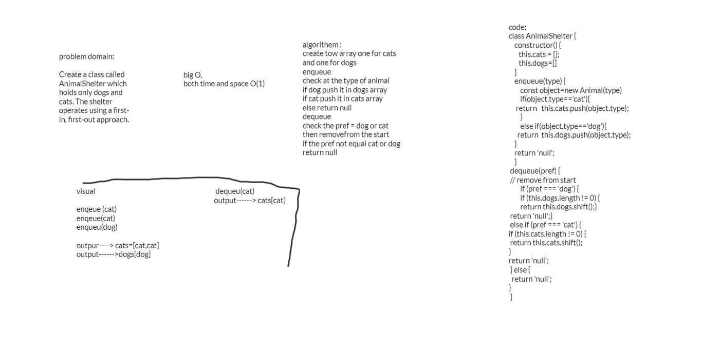

## problem domain:

Create a class called AnimalShelter which holds only dogs and cats. The shelter operates using a first-in, first-out approach.

## Approach & Efficiency :
create tow array one for cats and one for dogs
enqueue
check at the type of animal
if dog push it in dogs array
if cat push it in cats array
else return null
dequeue
check the pref = dog or cat 
then removefrom the start
if the pref not equal cat or dog
return null

## big O,
both time and space O(1)

