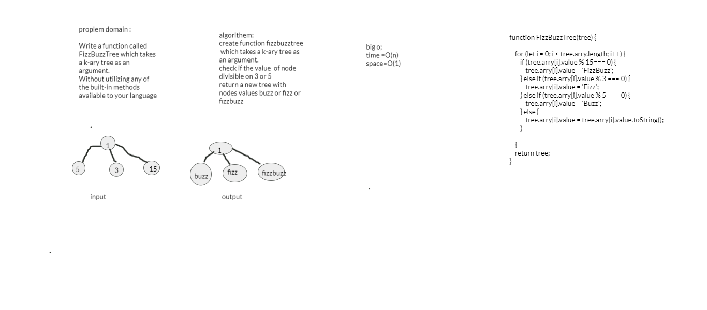

## challenge

Write a function called FizzBuzzTree which takes a k-ary tree as an argument.
Without utilizing any of the built-in methods available to your language

## Approach & Efficiency :
- create function fizzbuzztree
- which takes a k-ary tree as an argument.
- check if the value  of node divisible on 3 or 5
- return a new tree with nodes values buzz or fizz or fizzbuzz

## big O,
 time O(n) and space O(1)

