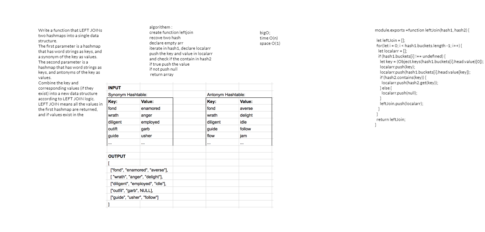

### challenge
Write a function that LEFT JOINs two hashmaps into a single data structure.
The first parameter is a hashmap that has word strings as keys, and a synonym of the key as values.
The second parameter is a hashmap that has word strings as keys, and antonyms of the key as values.
Combine the key and corresponding values (if they exist) into a new data structure according to LEFT JOIN logic.
LEFT JOIN means all the values in the first hashmap are returned, and if values exist in the

### Approach & Efficiency

create function leftjoin
recove two hash
declare empty arr
iterate in hash1, declare localarr
push the key and value in localarr
and check if the contain in hash2
if true push the value
if not push null
 return array
 
## time O(n),space O(1)
----------------
