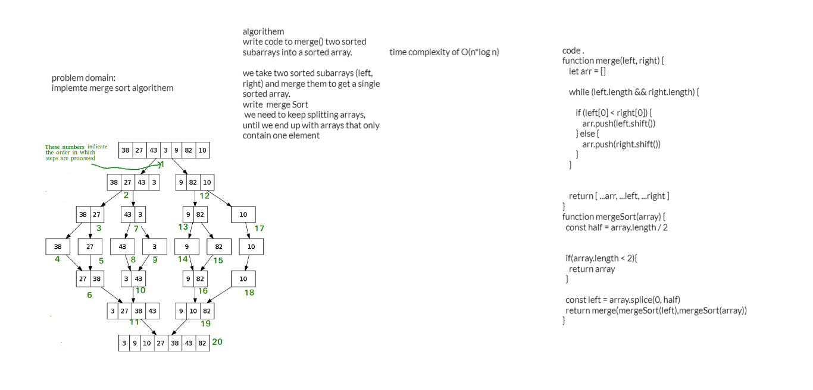

### code :

function merge(left, right) {
    let arr = []
   
    while (left.length && right.length) {
      
        if (left[0] < right[0]) {
            arr.push(left.shift())  
        } else {
            arr.push(right.shift()) 
        }
    }
    
   
    return [ ...arr, ...left, ...right ]
}
function mergeSort(array) {
  const half = array.length / 2
  
 
  if(array.length < 2){
    return array 
  }
  
  const left = array.splice(0, half)
  return merge(mergeSort(left),mergeSort(array))
}

----------------------
### algorithem:

write code to merge() two sorted subarrays into a sorted array.

we take two sorted subarrays (left, right) and merge them to get a single sorted array.
write  merge Sort 
 we need to keep splitting arrays, until we end up with arrays that only contain one element

### trace

--------------------

