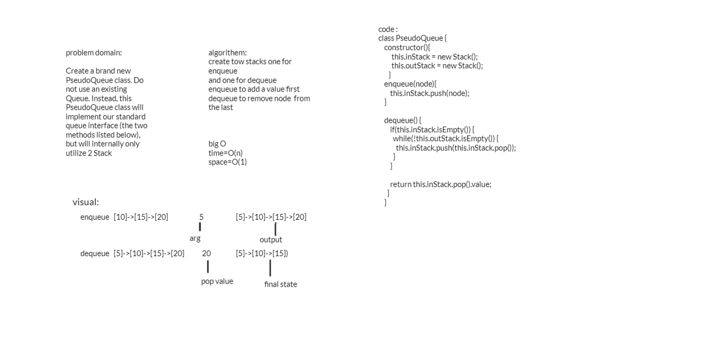

## problen
Create a brand new PseudoQueue class. Do not use an existing Queue. Instead, this PseudoQueue class will implement our standard queue interface (the two methods listed below), but will internally only utilize 2 Stack

## challeng 
algorithem:
create tow stacks one for enqueue
and one for dequeue
enqueue to add a value first
dequeue to remove node  from the last

## big O
time=O(n)
space=O(1)

