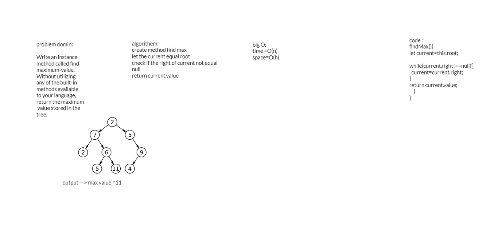

- Create a Node class that has properties for the value stored in the node, the left child node, and the right child node.
- Create a BinaryTree class
- Define a method for each of the depth first traversals called preOrder, inOrder, and postOrder which returns an array of the values, ordered appropriately.

- Create a BinarySearchTree class
- Define a method named add that accepts a value, and adds a new node with that value in the correct location in the binary search tree.
- Define a method named contains that accepts a value, and returns a boolean indicating whether or not the value is in the tree at least once.

- big o:
- time and space O(n)
- exepet adding time O(n) space O(1)

-----------------------------------------------------------
# code challenge 16

## Challenge
- Write a function called find-maximum-value which takes binary tree as its only input.
- Return the maximum value stored in the tree (without utilizing any of the built-in methods available to your language).
- You can assume that the values stored in the Binary Tree will be numeric.
## Approach & Efficiency

- reassign the max
- return the max

bigO
time = O(n)
space =O(h)

